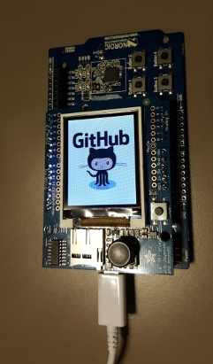

# Adafruit OLED 1.8 display on DK51 board

 [](LICENSE.md)

Integration of Adafruit OLED ST7735 1.8 display on Nordic Semiconductor NRF51 DK board



## Scope

* SPI communication between NRF51 board & display
* fill screen with specified color
* joystick (5 actions) switch through a sequence of color/image
* draw 128x160 bitmap 16 bit 

## Configuration

* armgcc toolchain
* no softdevice flash required
* nRF5 SDK 12.3.0

## Setup/Installation

* follow SDK/Toolchain Installation steps section of <a href="https://gist.github.com/bertrandmartel/a38315c5fe79ec5c8c6a9ed90b8df260#installation-steps">this tutorial</a>

* specify NRF51 SDK directory with :

```bash
export NRF51_SDK_DIR=/path/to/sdk
```

## Build

```bash
make
```

## Upload

```bash
//erase firmware
nrfjprog --family  nRF51 -e

//upload firmware
nrfjprog --family  nRF51 --program _build/nrf51422_xxac.hex

//start firmware
nrfjprog --family  nRF51 -r
```

or

```bash
./upload.sh
```

To debug your code : <a href="https://gist.github.com/bertrandmartel/a38315c5fe79ec5c8c6a9ed90b8df260#debug-your-code">check this link</a>

## External projects

* https://github.com/NordicSemiconductor/nrf51-ADC-examples
* https://github.com/adafruit/Adafruit-ST7735-Library
* https://github.com/NordicSemiconductor/nrf51-ble-app-lbs
* Nordic Semicondictor NRF51 SDK SPI sample code
* https://github.com/bertrandmartel/spi-master-slave-dk51

## License

The MIT License (MIT) Copyright (c) 2020 Bertrand Martel
